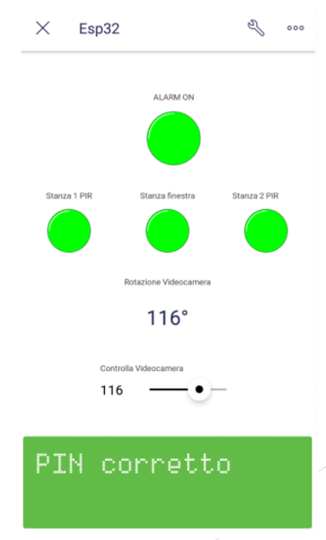

# Sistema di allarme domestico

## Descrizione
Si è voluto creare un prototipo di allarme domestico che simulasse un appartamento con più stanze al fine di riuscire a rilevare le intrusioni nelle stanze stesse.
Abbiamo ipotizzato un appartamento schematizzato come segue.

Le stanze 1 e 2 sono controllate da sensori PIR, mentre la stanza 3 è controllata tramite un bottone che simula l'apertura della finestra.
È presente anche un servo di 180 gradi che simula una videocamera: quando in una stanza verrà rilevata un'intrusione, la videocamera si ruoterà verso la stanza in cui è probabile che vi sia il ladro.
Per attivare e disattivare l'allarme è presente un tastierino fisico con cui si inserirà il PIN a 4 cifre settato a priori.

### Hardware necessario

   - ESP32
   - PIR sensor HC-SR501 (x2)
   - Micro Servo SG90
   - Tastierino a membrana
   - Buzzer
   - Button
   - Led RGB
	
### Software utilizzato
   - FreeRTOS OS
   - VS Code
   - Blynk 
   - Github per condividere il codice

## Tasks
**TaskPin**: legge il carattere inserito dal tastierino a membrana  
**TaskStamp**: stampa il PIN su LCD virtuale  
**TaskMotionSensor**: si occupa di controllare se il PIR ha rilevato movimenti  
**TaskWindowSensor**: si occupa di controllare se il bottone (che simula apertura della finestra) abbia rilevato aperture  
**TaskSiren**: quando è svegliato si occupa di modificare lo stato del buzzer in base allo stato in cui si trova il programma  
**TaskLED**: modifica lo stato del led RGB, in base allo stato in cui si trova il programma 
**TaskServo**: quando è svegliato modifica lo stato del servo in base allo stato in cui si trova il programma  
**TaskBlynk**: si occupa di gestire e di tenere aggiornato lo stato del nostro sistema di allarme con app Blynk  

## Diagramma di funzionamento

## Blynk App

<table>
  <tr>
    <td valign="top"></td>
    <td valign="top"></td>
  </tr>
</table>
L'applicazione è disponbile su PlayStore a questo [link](https://play.google.com/store/apps/details?id=cc.blynk&hl=it&gl=US)

## Demo
Video su YouTube: https://www.youtube.com/watch?v=fpsiMFx-kQc

È stato infine creato un modellino in legno (figura sotto) per simulare il sistema di allarme in un appartamento con 3 stanze

## Autori

[Pietro Orlandi](https://github.com/pietroorlandi)  
[Andrea Montanari](https://github.com/andrea-montanari)
